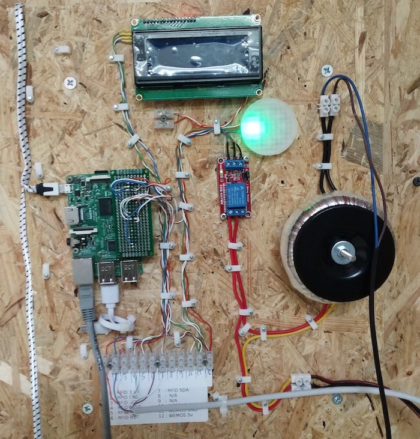

# Gate Py





## Hardware

+ Raspberry pi 3 (remember to switch the RPi.GPIO lib if switching the board)
+ Neopixel ring WS2812B
+ RFID reader RC522 (gotta enable SPI using `dt_param`/`dt_overlat` in `/boot/config.txt`)
+ Relay to open the door


## Setup

The gate's code requires python 3.

Generating the proto file:
```bash
apt install protobuf-compiler
protoc --python_out=. --proto_path=.. ../gate.proto
```

Setting up the pi (we went with a `Raspbian GNU/Linux 9 (stretch)`) as root:
```bash
apt install python3-venv

useradd --system --user-group --home-dir /opt/gate-py --create-home --shell /sbin/nologin gate-py
usermod -G spi -a gate-py
usermod -G gpio -a gate-py

cd /opt/gate-py
python3 -m venv [--prompt gate-py] .venv
source .venv/bin/activate
pip install -r requirements.txt

# copy the files to the directory

cp etc/gate.service /etc/systemd/system/gate-py.service
systemctl daemon-reload
systemctl enable gate-py
systemctl start gate-py

cp config.py.dist config.py
chmod o-r config.py
chgrp gate-py config.py
# don't forget to update it
```


## Deployment through gingerbread (LGHS specific)

```bash
# Open the tunnel once
ssh -fNL 8022:gate-internal.lghs.space:22 gingerbread


scp -P8022 *.py root@localhost:/root/OrangePiZeroMFRC522/MFRC522-python/ \
    && ssh -p8022 root@localhost systemctl restart gate
```


## Wiegand

The [`wiegand.py`](wiegand.py) file allows reading data from a wiegand device, but it only allows reading half the id of the card.
It could be used inside the space to identify members on restricted equipment, but colisions make it a last resort tool.

That program requires pigpiod which can be installed using the following commands

```bash
sudo apt install python3

python3 -m venv -p python3 .venv
source .venv/bin/activate
pip install pigpio

mkdir libs
cd libs
git clone https://github.com/joan2937/pigpio.git
cd pigpio
make
sudo LD_LIBRARY_PATH=. ./pigpiod # should be started as a service if the thing becomes permanent
```
